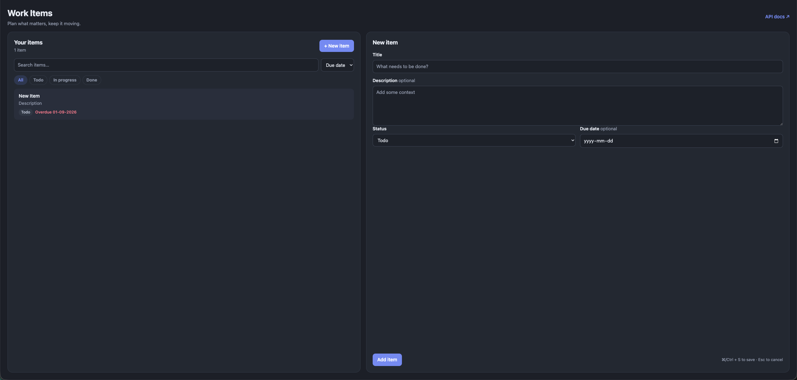
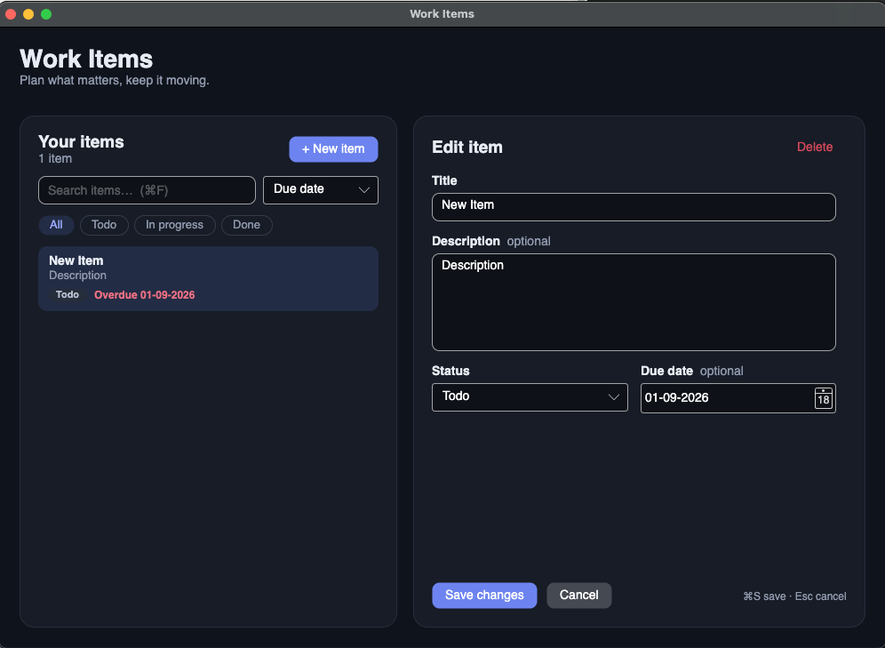
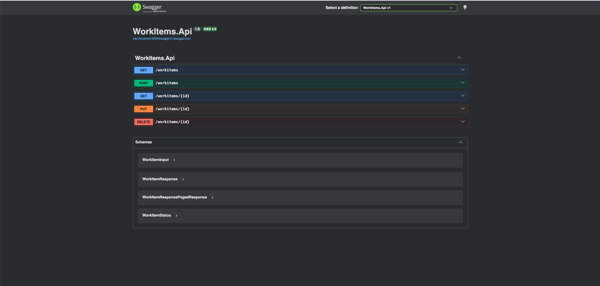

# Work-Item Tracker

A .NET 10 work-item tracker with a browser UI and an Avalonia macOS client. Both use the same API and SQLite data.

| Web | macOS desktop |
| --- | --- |
|  |  |



## Web

Install the .NET 10 SDK, then from this directory:

```sh
dotnet restore WorkItems.sln
dotnet run --project WorkItems.Api --urls http://localhost:5000
```

Open http://localhost:5000/ in a browser. The web client is served from `WorkItems.Api/wwwroot`; http://localhost:5000/swagger exposes the API in Development, which `dotnet run` uses via `Properties/launchSettings.json`; other environments don't serve it. SQLite stores items in `WorkItems.Api/workitems.db`.

## Test

```sh
dotnet test WorkItems.sln
```

The integration tests use a temporary SQLite database and cover web asset delivery, API and desktop-client CRUD, validation, missing items, and date conversion.

## macOS desktop

On macOS, the Avalonia client is a separate .NET 10 project. It calls the API and does not open the SQLite file directly. Run these in two terminals from the repository root:

```sh
dotnet run --project WorkItems.Api --urls http://localhost:5000
```

```sh
dotnet run --project WorkItems.Desktop
```

The desktop app uses `http://localhost:5000` by default. Set `WORKITEMS_API_URL` to a different API base URL if needed. Items appear on the left with search and status filters; select one to edit or delete it on the right, or choose **+ New item**. Due dates use a date picker and display as `DD-MM-YYYY`. Shortcuts: ⌘N new, ⌘S or ⌘Enter save, ⌘F search, Esc cancel edit. Both clients follow the system light/dark setting. The browser and desktop clients show the same items after refreshing.

For an Apple Silicon macOS executable, run `dotnet publish WorkItems.Desktop -r osx-arm64 --self-contained false`; the executable is under `WorkItems.Desktop/bin/Release/net10.0/osx-arm64/publish/`. It still needs the .NET 10 runtime and a running API.

## Try the API

```sh
curl -X POST http://localhost:5000/workitems/ -H 'Content-Type: application/json' \
  -d '{"title":"Practice async/await","status":0}'
curl 'http://localhost:5000/workitems/?status=todo&search=async&sort=dueDate&page=1&pageSize=20'
```

Status values are `0` (Todo), `1` (InProgress), and `2` (Done). Both UIs pick due dates with a date picker and list them as `DD-MM-YYYY`; the API uses ISO timestamps. `PUT /workitems/{id}` replaces the editable fields; `DELETE /workitems/{id}` removes the item. Both require `If-Match` with the item's current version (returned as `version` and as the `ETag` header): a missing header returns `428`, a stale one `412`, so a client can't silently overwrite someone else's change. The UIs then offer **Reload** or **Overwrite**.

```sh
curl -X PUT http://localhost:5000/workitems/1 -H 'If-Match: "0"' -H 'Content-Type: application/json' \
  -d '{"title":"Practice async/await","status":1}'
```

`GET /workitems/` returns `{ items, total, page, pageSize }`. Optional query parameters, all case-insensitive:
`status` (`todo`, `inProgress`, `done`), `search` (title or description), `tag`, `sort` (`dueDate` — default, undated last — `createdAt`, `title`, `status`), `desc` (`true`/`false`), `page` (from 1), `pageSize` (1–100, default 50). Invalid values return `400` with field errors.

Items carry `tags` (string array; at most 10, each up to 30 characters). Tags are shared and matched case-insensitively, so `EF-Core` and `ef-core` are the same tag. `GET /tags` lists tags in use with their item counts. In both UIs, click a tag on an item to filter by it.

The API applies EF Core migrations at startup. The local database was baselined to the initial migration without removing existing items. Azure deployment is a planned next step.

To add a migration after changing the model, use the repo-local EF tool:

```sh
dotnet tool restore
dotnet ef migrations add <Name> --project WorkItems.Api
```
